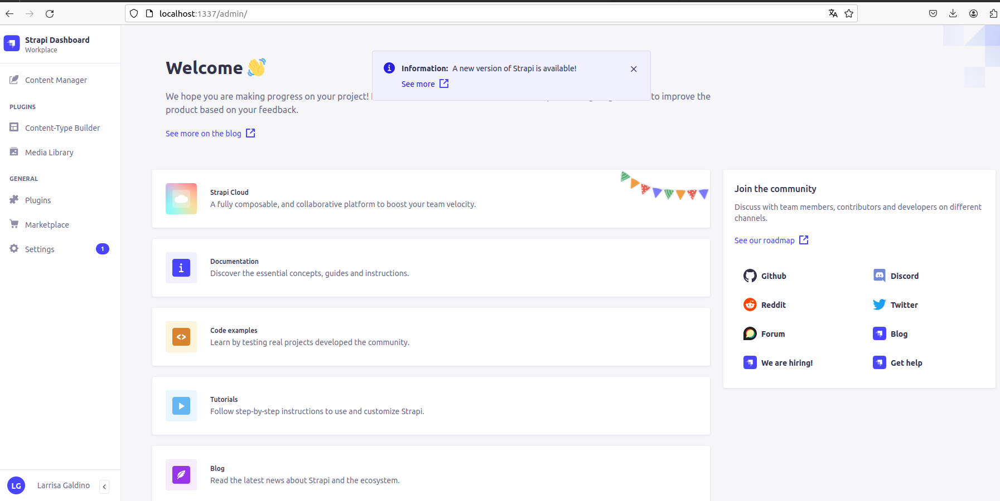
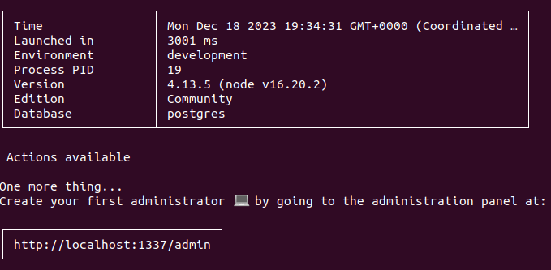
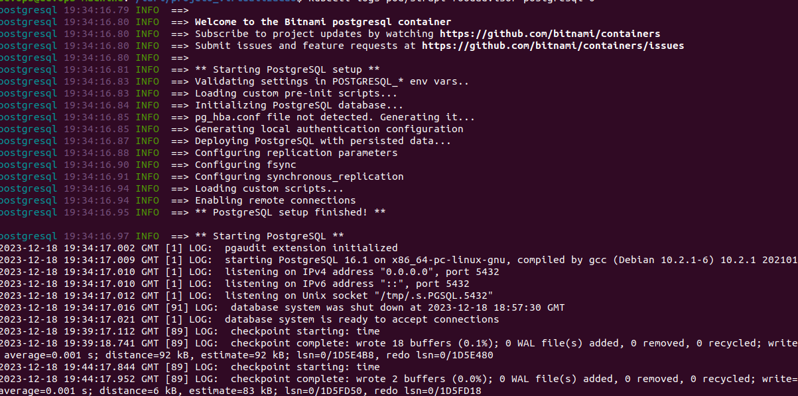

# Virtualização 2023.2 - Projeto da disciplina

## Objetivo

O objetivo do projeto é configurar uma aplicação web usando o Strapi e o PostgreSQL, implantando-a em um cluster Kubernetes.

## Serviço

O serviço a ser implementado será uma aplicação web simples usando o Strapi como framework. O Strapi é uma plataforma de conteúdo headless que permite criar APIs e aplicações web baseadas em conteúdo. O PostgreSQL será usado como banco de dados para armazenar os dados da aplicação.

Para a aplicação, utilizaremos a [Food Advisor](https://github.com/strapi/foodadvisor.git), uma aplicação de demonstração implementada no Stripe. Para tal, a ideia é fazer o clone desse repositório, a construção da imagem docker, a criação do Helm chart e em seguida a implantação em um cluster Kubernetes.

## Recursos do Kubernetes

Os recursos do Kubernetes necessários para o projeto são:

### Para o Strapi:

- Dois pods: um para api e outro para o client
- Dois serviços: um para api e outro para o client
- Um secret para guardar as credenciais de conexão da api com o banco
- Dois deployments: um para api e outro para o client
- Dois ingress: um para api e outro para o client

### Para o PostgreSQL:

Utilize o chart pronto do PostgreSQL disponível no repositório da Bitnami: [Bitnami PostgreSQL Chart](https://github.com/bitnami/charts/tree/main/bitnami/postgresql)

## Criação da imagem Docker

Será necessária a criação de duas imagens Docker, uma para a API e outra para o client. Siga este [tutorial](https://strapi.io/blog/deploying-and-scaling-the-official-strapi-demo-app-food-advisor-with-kubernetes-and-docker) para criar os Dockerfiles referentes à cada imagem e fazer a construção das imagens da API e do client.

Com a imagem Docker criada, crie o helm chart da aplicação usando o seguinte comando:

```bash
helm create strapi-foodadvisor
```

O chart Helm será configurado para usar a imagem Docker criada anteriormente. Também será configurada a dependência do chart para o PostgreSQL. Lembre-se de checar as variáveis de ambientes necessárias para fazer a conexão da api com o postgres. Pode-se encontrar a definição dessas variáveis [aqui](https://github.com/strapi/foodadvisor/blob/master/api/config/database.js)

## Implantação do serviço

O serviço será implantado usando o seguinte comando:

```bash
helm install strapi-foodadvisor ./strapi-foodadvisor
```

## Teste do serviço
O serviço poderá ser testado usando o seguinte comando:

```bash
kubectl port-forward svc/ingress-nginx-controller 8889:80 -n ingress-nginx
```

Após, basta acessar o navegador na porta 8889 e referenciar o path que foi configurado no ingress para api e para o client. Ele deverá exibir as aplicações web.

Aqui estão alguns detalhes adicionais que você pode considerar ao especificar seu projeto:

Qual versão do Strapi e do PostgreSQL você deseja usar?
Como você deseja testar o serviço? Você pode usar um cluster Kubernetes local (minikube) ou um ambiente de teste.

<hr>

# Procedimentos:

Pré-requisitos:

- Para rodar o projeto é necessário ter o Helm chart, minikube e o kubectl. Confira na documentação de cada uma dessas ferramentas a forma de instalação.

- Levante o minikube através do driver do Docker da seguinte forma: minikube config set driver docker ; minikube start

- Adicione no arquivo /etc/hosts o host do ingress da seguinte forma:

```bash
127.0.0.1 foodadvisor.client
127.0.0.1 foodadvisor.backend
```

Na sequência, continue com os seguintes passos:

```bash
habilitar o Ingress: minikube addons enable ingress
git clone https://github.com/larissaifpb/projeto_virtualizacao.git 
cd projeto_virtualizacao/strapi-foodadvisor`
helm dependency update
cd ..
helm upgrade strapi-foodadvisor ./strapi-foodadvisor --install
```

<h3>Verificações</h3>

Aguarde todo o deploy do cluster finalizar, em seguida, realize o port-forward para expor a aplicação na porta 8889:

- kubectl port-forward svc/ingress-nginx-controller 8889:80 -n ingress-nginx

Após isso acesse no Browser:

- Api do Strapi: http://foodadvisor.backend:8889/

Obs: Utilize o comando: `kubectl port-forward svc/foodadvisor-backend 1337:80` e acesse o endereço http://localhost:1337 para realizar o cadastro da conta de administrador e passar a utilizar os recursos do Strapi.

<p align="center">
    
</p>

- Já com relação à parte do cliente, quando acessamos o endereço: http://foodadvisor.client:8889/ nos deparados com o código de resposta 404, ou seja, apesar do frontend conseguir estabelecer uma comunicação com a API, como o banco não está populado o frontend não consegue retornar nenhuma informação ao usuário resultando então neste evento.

- Para as verificações do banco de dados, ao checar algumas informações do cluster vemos que o PostgreSQL foi integrado como banco de dados para a aplicação conforme a configuração criada no Helm chart. As imagens abaixo retratam isso:

<p align="center">
    
    <br><br>
    
</p>

Obs: Para o acesso ao banco, foi realizado o port-forward da seguinte maneira: kubectl port-forward svc/strapi-foodadvisor-postgresql 5432:5432

Em seguida, para acessá-lo:

```bash
psql -h localhost -p 5432 -U strapi -d strapi
password: strapi
```

<h3>Referências</h3>

[Helm Chart](https://helm.sh/)<br>
[Minikube](https://minikube.sigs.k8s.io/docs/)<br>
[Kubernetes](https://kubernetes.io/docs/home/)<br>
